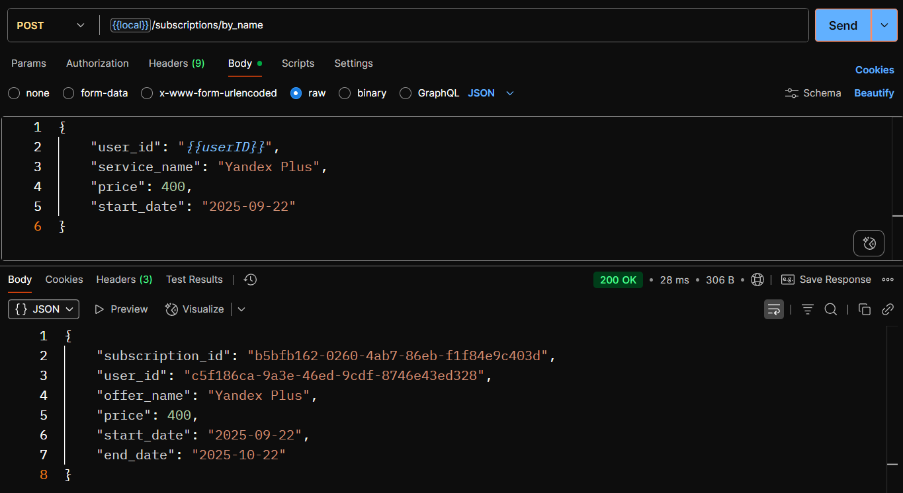

# Subscriptions Service
Сервис для агрегации онлайн-подписок пользователей.  
Тестовое задание.
---
## Схема БД
Было решено организовать хранение записей следующим образом: было создано две таблицы: **offers** и **subscriptions**. 

В офферах хранятся варианты всех подписок: 
- имя сервиса
- цена
- длительность в месяцах

Может содержать две подписки с одинаковым именем сервиса, но разной ценой и длительностью (например для подписки на месяц и на год).

В таблице подписок хранится:
- ID пользователя
- ссылка на подписку из **offers**
- дата начала подписки
- дата окончания (дата начала подписки + длительность из **offers**) 

Подобная схема обеспечивает нормализованность данных, так как данные самой подписки не дублируются в общей таблице, при этом сохраняется историчность.

## Функционал

**Предложения (offers)**:
- Создание нового оффера с параметрами:
    - имя сервиса
    - цена
    - длительность подписки (в месяцах)

- Получение списка офферов всех доступных офферов
- Удаление оффера. При удалении производится проверка на наличие ссылающихся подписок на оффер, если такие есть, возвращается ошибка

**Подписки (subscriptions)**:
  - Создание подписки по имени сервиса и цене. При этом оффер автоматически создается с задаными параметрами
  - Создание подписки по `offer_id` из уже имеющихся офферов
  - Получение всех подписок
  - Получение подписок пользователя
  - Получение подписок пользователя **вместе с общей суммой** по названию сервиса и указанному периоду
  - Удаление подписки

---

## Стек
- **Golang** 
- **Echo** 
- **PostgreSQL**
- **Goose** 
- **pgx + Squirrel**
- **logrus** 
- **Swagger (swaggo/swag)**
- **Docker + Docker Compose** 
---
## Установка и запуск

### 1. Клонируйте репозиторий
    git clone https://github.com/4udiwe/subscription-service.git
    cd subscription-service

### 2. Запустите сервис
    docker compose up --build

Сервис поднимется на http://localhost:8080.

## Документация API
Swagger доступен по адресу:

http://localhost:8080/swagger/index.html

Файл сгенерированной спецификации: docs/swagger.json.

## Примеры запросов

  
Примеры запросов

Создание подписки по имени сервиса.

  

Получение всех офферов.

  

Получение подписок по ID пользователя.

  

Получение всех подписок на конкретный сервис по ID пользователя.

  

Получение всех подписок пользователя на серви за выбранный период.

  

